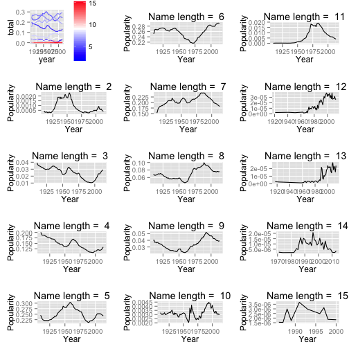

Baby Names!
========================================================

The analysis could be recreated by running the file `run.R` in R by `source("run.R")`.
The data are from [http://www.ssa.gov/oact/babynames/state/namesbystate.zip](http://www.ssa.gov/oact/babynames/state/namesbystate.zip).


Load Data
----------
The data set is loaded with the following code.

```r
# Get the data from the web
fileUrl <- "http://www.ssa.gov/oact/babynames/state/namesbystate.zip"
download.file(fileUrl, destfile = "namesbystate.zip")
unzip("namesbystate.zip")
# batch read files
files <- list.files(pattern = ".TXT$")
babyname <- lapply(files, read.table, sep = ",")
babyname <- do.call(rbind,babyname)
# Set column names
names(babyname) <- c("state", "gender", "year", "name", "count")
```

For later analysis, I identify states for each region in the United States.

```r
NorthWest <- c("CT", "ME", "MA", "NH", "RI", "VT", "NJ", "NY", "PA")
MidWest <- c("IL", "IN", "MI", "OH", "WI", "IA", "KS", "MN", "MO", "NE", "ND", "SD")
South <- c("DE", "FL", "GA", "MD", "NC", "SC", "VA", "DC", "WV", "AL", "KY", "MS", "TN", "AR", "LA", "OK", "TX")
West <- c("AZ", "CO", "ID", "MT", "NV", "NM", "UT", "WY", "AK", "CA", "HI", "OR", "WA")
```

And load all packages needed.

```r
library(plyr)
library(dplyr)
```

```
## 
## Attaching package: 'dplyr'
## 
## The following objects are masked from 'package:plyr':
## 
##     arrange, count, desc, failwith, id, mutate, rename, summarise,
##     summarize
## 
## The following object is masked from 'package:stats':
## 
##     filter
## 
## The following objects are masked from 'package:base':
## 
##     intersect, setdiff, setequal, union
```

```r
library(tidyr)
library(data.table)
```

```
## 
## Attaching package: 'data.table'
## 
## The following objects are masked from 'package:dplyr':
## 
##     between, last
```

```r
library(reshape2)
library(ggplot2)
```

Let's check some summary statistics.

```r
str(babyname)
```

```
## 'data.frame':	5552452 obs. of  5 variables:
##  $ state : Factor w/ 51 levels "AK","AL","AR",..: 1 1 1 1 1 1 1 1 1 1 ...
##  $ gender: Factor w/ 2 levels "F","M": 1 1 1 1 1 1 1 1 1 1 ...
##  $ year  : int  1910 1910 1910 1910 1910 1910 1910 1910 1911 1911 ...
##  $ name  : Factor w/ 29828 levels "Aaliyah","Aaron",..: 1062 95 90 1037 623 495 996 453 1062 1037 ...
##  $ count : int  14 12 10 8 7 6 6 5 12 7 ...
```

```r
summary(babyname)
```

```
##      state         gender           year           name        
##  CA     : 347231   F:3102565   Min.   :1910   Leslie :   7156  
##  TX     : 317730   M:2449887   1st Qu.:1949   Lee    :   7097  
##  NY     : 273134               Median :1976   James  :   6985  
##  IL     : 211244               Mean   :1972   John   :   6813  
##  FL     : 183322               3rd Qu.:1998   Robert :   6768  
##  PA     : 182725               Max.   :2013   Jessie :   6591  
##  (Other):4037066                              (Other):5511042  
##      count         
##  Min.   :    5.00  
##  1st Qu.:    7.00  
##  Median :   13.00  
##  Mean   :   53.26  
##  3rd Qu.:   34.00  
##  Max.   :10025.00  
## 
```


Descriptive Analysis
--------------------

### Question1
Please describe the format of the data files. Can you identify any limitations or distortions of the data?
The files are in CSV format and each record is separated by a comma. If the record contains comma, CSV format 
cannot distinguish the record and the delimiter. As described in [Social Security website](http://www.ssa.gov/oact
/babynames/limits.html), this particular data set contains only names with at least 5 occurrences in each state.
Therefore, if a state has many unique names with less than 5 occurrences, then the popularity of a name for a year 
in that state (calculated by the occurrences of that name in a year divided by the total number of occurrences 
of any name in a year) will be biased. In addition, the data set contains only names with length between 2 and 15.
And it does not contain names with special characters (e.g. Amélie). It is unclear how special characters are 
treated in this data set. 

### Question 2
What is the most popular name of all time? (Of either gender.)
This can be done by apply the `sum` function to count of names by each name.

```r
head(sort(tapply(babyname$count, babyname$name, sum), decreasing = TRUE))
```

```
##   James    John  Robert Michael William    Mary 
## 4942431 4834422 4718787 4297230 3822209 3737679
```
The most popular name of all time is James with 4,942,431 occurrences, followed by John with 4,834,422 occurrences.

### Question 3
What is the most gender ambiguous name in 2013? 1945?
I wrote a function to answer this quesiton. This function compute the proportion of female/male for a given 
name. The proportion of female for a given name is called propF in the function. To compare gender ratio, 
I compute the absolute difference between propF and 0.5, where 0.5 is the case when equal number of male/female
have the given name. This absolute difference is called deviance in the function, and the smaller the deviance,
the more gender-neutral the name is (more gender ambiguous).

```r
genderNeutral <- function(data, year) {
  #subset data
  data <- data[(data$year == year),]
  #combine counts from different states and drop year
  data <- aggregate(data$count, by = list(data$year, data$name, data$gender), FUN = sum)
  data <- data[,-1]
  names(data) <- c("name", "gender", "count")
  # spread the data for two gender level
  byName <- spread(data, gender, count)
  # replace NA with 0
  byName[is.na(byName)] <- 0
  # create new variable that records proportion of female for each name
  byName <- mutate(byName, propF = F/(F+M), deviance = abs(F/(F+M) - 0.5))
  print(head(arrange(byName,deviance, desc(F)), n = 10))
}
```

And then I applied the function to year 1945 and 2013.
The most gender ambiguous names for 2013 are: 

```r
genderNeutral(babyname, 2013)
```

```
##      name   F   M    propF   deviance
## 1  Nikita  47  47 0.500000 0.00000000
## 2    Aris  15  15 0.500000 0.00000000
## 3    Cree  11  11 0.500000 0.00000000
## 4     Tru  11  11 0.500000 0.00000000
## 5  Devine  10  10 0.500000 0.00000000
## 6   Arlin   5   5 0.500000 0.00000000
## 7   Eliah   5   5 0.500000 0.00000000
## 8   Sonam   5   5 0.500000 0.00000000
## 9    Jael 123 130 0.486166 0.01383399
## 10  Milan 422 450 0.483945 0.01605505
```

The most gender ambiguous names for 1945 are: 

```r
genderNeutral(babyname, 1945)
```

```
##       name    F    M     propF   deviance
## 1    Maxie   19   19 0.5000000 0.00000000
## 2    Artie   23   22 0.5111111 0.01111111
## 3   Lavern   70   74 0.4861111 0.01388889
## 4  Frankie  482  549 0.4675073 0.03249273
## 5   Barrie    8    7 0.5333333 0.03333333
## 6  Hillary    7    6 0.5384615 0.03846154
## 7  Cameron    6    7 0.4615385 0.03846154
## 8   Jessie 1072  910 0.5408678 0.04086781
## 9   Leslie 1678 1977 0.4590971 0.04090287
## 10  Jackie 1245 1473 0.4580574 0.04194260
```

This function can be applied to any given year.


### Question 4
Of the names represented in the data, find the name that has had the largest percentage increase in popularity since 1980. Largest decrease?

I first created a new data set **allYear** that contains year, name, count, total number of names for the year,
and proportion of the name relative to all names in that year. The last variable `prop` reflects the popularity
of a name in that year. The higher the proportion, the more popular the name in that year.

```r
# combine counts from different states and different gender
allYear <- aggregate(babyname$count, by = list(babyname$year, babyname$name), FUN = sum)
names(allYear) <- c("year", "name", "count")

# compute the total number of names for each year
countByYear <- ddply(allYear, .(year), summarise, total = sum(count))
# join allYear with countByYear by "year"
allYear <- merge(allYear, countByYear, by.x = "year", by.y = "year")
# create new variable: proportion of a given name relative to all names in that year
allYear <- mutate(allYear, prop = count / total)
```

And let's take a look at *allYear*.

```r
head(allYear)
```

```
##   year      name count  total         prop
## 1 1910   Roberto    16 516307 3.098931e-05
## 2 1910    Otelia     7 516307 1.355783e-05
## 3 1910     Hiram    11 516307 2.130515e-05
## 4 1910     Clair    19 516307 3.679981e-05
## 5 1910 Enriqueta     8 516307 1.549466e-05
## 6 1910   Felicia    16 516307 3.098931e-05
```

Now let's compare the popularity of names in 1980 and 2013.
I select year 1980 and 2013 from *allYear*, and inner join these two data sets by name.
This will only keep names that are present in both years.
Then I create a new variable `prop.diff` that computes the difference between popularity.


```r
# compute differences of prop between 1980 and 2013 for each name.
year1980 <- allYear[(allYear$year == 1980),]
year2013 <- allYear[(allYear$year == 2013),]
# inner join two data sets using name
combineTable <- merge(year1980, year2013, by.x = "name", by.y = "name")
combineTable <- mutate(combineTable, prop.diff = prop.y - prop.x)
```

The top 10 names that has had the largest percentage increase in popularity since 1980 are:

```r
# Top 10 names increase in popularity
head(arrange(combineTable, desc(prop.diff)), n = 10)
```

```
##        name year.x count.x total.x       prop.x year.y count.y total.y
## 1    Sophia   1980     584 3129817 1.865924e-04   2013   21075 3049905
## 2      Emma   1980     481 3129817 1.536831e-04   2013   20793 3049905
## 3      Liam   1980      71 3129817 2.268503e-05   2013   18002 3049905
## 4  Isabella   1980      23 3129817 7.348672e-06   2013   17490 3049905
## 5     Mason   1980     296 3129817 9.457422e-05   2013   17615 3049905
## 6      Noah   1980     899 3129817 2.872372e-04   2013   18120 3049905
## 7    Olivia   1980    1089 3129817 3.479437e-04   2013   18256 3049905
## 8     Ethan   1980     670 3129817 2.140700e-04   2013   16127 3049905
## 9       Ava   1980      61 3129817 1.948996e-05   2013   15134 3049905
## 10   Elijah   1980     732 3129817 2.338795e-04   2013   13626 3049905
##         prop.y   prop.diff
## 1  0.006910051 0.006723459
## 2  0.006817589 0.006663906
## 3  0.005902479 0.005879794
## 4  0.005734605 0.005727256
## 5  0.005775590 0.005681016
## 6  0.005941169 0.005653931
## 7  0.005985760 0.005637817
## 8  0.005287706 0.005073636
## 9  0.004962122 0.004942632
## 10 0.004467680 0.004233801
```

And the top 10 names that has had the largest percentage decrease in popularity since 1980 are:

```r
# Top 10 names decrease in popularity
head(arrange(combineTable, desc(-prop.diff)), n = 10)
```

```
##           name year.x count.x total.x      prop.x year.y count.y total.y
## 1     Jennifer   1980   58533 3129817 0.018701732   2013    1666 3049905
## 2      Michael   1980   69160 3129817 0.022097139   2013   15366 3049905
## 3        Jason   1980   48438 3129817 0.015476304   2013    5458 3049905
## 4  Christopher   1980   49340 3129817 0.015764500   2013   10765 3049905
## 5       Amanda   1980   35843 3129817 0.011452107   2013    1042 3049905
## 6      Jessica   1980   33988 3129817 0.010859421   2013    1909 3049905
## 7      Melissa   1980   31727 3129817 0.010137014   2013    1552 3049905
## 8        David   1980   42159 3129817 0.013470117   2013   12226 3049905
## 9       Robert   1980   34455 3129817 0.011008631   2013    6641 3049905
## 10       Brian   1980   28816 3129817 0.009206928   2013    2614 3049905
##          prop.y    prop.diff
## 1  0.0005462465 -0.018155486
## 2  0.0050381897 -0.017058949
## 3  0.0017895639 -0.013686740
## 4  0.0035296181 -0.012234882
## 5  0.0003416500 -0.011110457
## 6  0.0006259211 -0.010233500
## 7  0.0005088683 -0.009628146
## 8  0.0040086494 -0.009461467
## 9  0.0021774449 -0.008831186
## 10 0.0008570759 -0.008349852
```

### Question 5
Can you identify names that may have had an even larger increase or decrease in popularity?

Utilizing the *allYear* data set, we can repeat the same procedure in 4. 
Now let's compare year 1910 and 2013.

```r
year1910 <- allYear[(allYear$year == 1910),]
# inner join two data sets using name
combineTable2 <- merge(year1910, year2013, by.x = "name", by.y = "name")
combineTable2 <- mutate(combineTable2, prop.diff = prop.y - prop.x)
```

The top 10 names that has had the largest percentage increase in popularity since 1910 are:

```r
head(arrange(combineTable2, desc(prop.diff)), n = 10)
```

```
##         name year.x count.x total.x       prop.x year.y count.y total.y
## 1     Sophia   1910     235  516307 4.551556e-04   2013   21075 3049905
## 2       Noah   1910      44  516307 8.522061e-05   2013   18120 3049905
## 3     Olivia   1910     176  516307 3.408825e-04   2013   18256 3049905
## 4   Isabella   1910     105  516307 2.033674e-04   2013   17490 3049905
## 5      Jacob   1910     225  516307 4.357872e-04   2013   17976 3049905
## 6        Ava   1910      30  516307 5.810496e-05   2013   15134 3049905
## 7     Elijah   1910      74  516307 1.433256e-04   2013   13626 3049905
## 8  Alexander   1910     280  516307 5.423130e-04   2013   14771 3049905
## 9    Jackson   1910      21  516307 4.067348e-05   2013   12488 3049905
## 10   Matthew   1910     168  516307 3.253878e-04   2013   13226 3049905
##         prop.y   prop.diff
## 1  0.006910051 0.006454896
## 2  0.005941169 0.005855948
## 3  0.005985760 0.005644878
## 4  0.005734605 0.005531237
## 5  0.005893954 0.005458167
## 6  0.004962122 0.004904017
## 7  0.004467680 0.004324355
## 8  0.004843102 0.004300789
## 9  0.004094554 0.004053880
## 10 0.004336529 0.004011141
```

```r
topNameIncrease <- arrange(combineTable2, desc(prop.diff))$name[1:10]
```
The largest percentage increase in popularity since 1910 is smaller than that since 1980.

Let's check the top 10 names that has had the largest percentage decrease in popularity since 1910.

```r
head(arrange(combineTable2, desc(-prop.diff)), n = 10)
```

```
##        name year.x count.x total.x     prop.x year.y count.y total.y
## 1      Mary   1910   22906  516307 0.04436508   2013    2589 3049905
## 2     Helen   1910   10484  516307 0.02030575   2013     693 3049905
## 3      John   1910   11479  516307 0.02223290   2013   10588 3049905
## 4  Margaret   1910    8229  516307 0.01593819   2013    1743 3049905
## 5   Dorothy   1910    7314  516307 0.01416599   2013     277 3049905
## 6      Ruth   1910    7208  516307 0.01396069   2013     946 3049905
## 7     James   1910    9202  516307 0.01782273   2013   13416 3049905
## 8   William   1910    8849  516307 0.01713903   2013   16495 3049905
## 9   Mildred   1910    5690  516307 0.01102057   2013      46 3049905
## 10     Anna   1910    6433  516307 0.01245964   2013    5315 3049905
##          prop.y   prop.diff
## 1  8.488789e-04 -0.04351620
## 2  2.272202e-04 -0.02007853
## 3  3.471584e-03 -0.01876131
## 4  5.714932e-04 -0.01536670
## 5  9.082250e-05 -0.01407517
## 6  3.101736e-04 -0.01365051
## 7  4.398826e-03 -0.01342390
## 8  5.408365e-03 -0.01173066
## 9  1.508244e-05 -0.01100549
## 10 1.742677e-03 -0.01071696
```

```r
topNameDecrease <- arrange(combineTable2, desc(-prop.diff))$name[1:10]
```
This shows that **Mary**, **Helen** and **John** have had even larger decrease in popularity since 1910 than
**Jennifer** since 1980.

Now let's try to plot the trend of these top 10 name increase/decrease in popularity.
In order to do that, I wrote two functions to plot trend in popularity for a given name.
And the multiplot function is from [Cookbook for R](http://www.cookbook-r.com/Graphs/Multiple_graphs_on_one_page_%28ggplot2%29/).

```r
## This function plot the trend for a given name
plotNameTrend <- function(data, name) {
  nameData <- data[(data$name == name),]
  g <- ggplot(nameData, aes(year, prop)) + geom_line() + labs(x = "Year", y = "Popularity", title = nameData$name)
  return(g)
}

## This function create a multiplot for a list of name using the plotNameTrend() function.
plotNameList <- function(data, nameList) {
  plots <- list()
  for (i in seq(along = nameList)) {
    g <- plotNameTrend(data, nameList[i])  
    plots[[i]] <- g
  }
  multiplot(plotlist = plots, cols = 2)
}

# Multiple plot function
#
# ggplot objects can be passed in ..., or to plotlist (as a list of ggplot objects)
# - cols:   Number of columns in layout
# - layout: A matrix specifying the layout. If present, 'cols' is ignored.
#
# If the layout is something like matrix(c(1,2,3,3), nrow=2, byrow=TRUE),
# then plot 1 will go in the upper left, 2 will go in the upper right, and
# 3 will go all the way across the bottom.
#
multiplot <- function(..., plotlist=NULL, file, cols=1, layout=NULL) {
  library(grid)
  
  # Make a list from the ... arguments and plotlist
  plots <- c(list(...), plotlist)
  
  numPlots = length(plots)
  
  # If layout is NULL, then use 'cols' to determine layout
  if (is.null(layout)) {
    # Make the panel
    # ncol: Number of columns of plots
    # nrow: Number of rows needed, calculated from # of cols
    layout <- matrix(seq(1, cols * ceiling(numPlots/cols)),
                     ncol = cols, nrow = ceiling(numPlots/cols))
  }
  
  if (numPlots==1) {
    print(plots[[1]])
    
  } else {
    # Set up the page
    grid.newpage()
    pushViewport(viewport(layout = grid.layout(nrow(layout), ncol(layout))))
    
    # Make each plot, in the correct location
    for (i in 1:numPlots) {
      # Get the i,j matrix positions of the regions that contain this subplot
      matchidx <- as.data.frame(which(layout == i, arr.ind = TRUE))
      
      print(plots[[i]], vp = viewport(layout.pos.row = matchidx$row,
                                      layout.pos.col = matchidx$col))
    }
  }
}
```

Then we can check the trend of those top 10 names that have had the largest percentage increase/decrease in
popularity.

```r
# drop count and total
propAllYear <- select(allYear, -count, -total)

plotNameList(propAllYear, topNameIncrease)
```

 

```r
plotNameList(propAllYear, topNameDecrease)
```

 

Onward to Insight!
------------------
There are many interesting questions can be asked for this data set. Here I tried to address some of them.

1. Do people prefer longer names nowadays?

To answer this question, I utilize the **propAllYear** data to create a new data set **nameLength** that record
the popularity for each name length for each year


```r
propAllYear$name <- as.character(propAllYear$name)
# create new variable: length of each name
nameLength <- mutate(propAllYear, nchar = nchar(name))
# delete name column
nameLength <- select(nameLength, -name)
# combine prop for the same length of name for each year
nameLength <- ddply(nameLength, .(year, nchar), summarise, total = sum(prop))
head(nameLength)
```

```
##   year nchar        total
## 1 1910     2 0.0004454714
## 2 1910     3 0.0393699872
## 3 1910     4 0.1994104283
## 4 1910     5 0.2449376050
## 5 1910     6 0.2531129735
## 6 1910     7 0.1524674273
```

Then I plot the trend by each number of characters in name. Since the popularity of each name length differs 
a lot, I also create individual plots.

```r
# plot the name length trend 
plots <- list()
g <- ggplot(nameLength, aes(year, total, group = nchar, color = nchar))
plots[[1]] <- g + geom_line() + scale_color_gradient2(midpoint = 9, low = "blue", mid = "white", high = "red")

# plot the trend for each name length (easier to check the trend)
for (i in 2:15) {
  nameLength_sub <- nameLength[(nameLength$nchar == i),]
  myTitle <- paste("Name length = ", i)
  g <- ggplot(nameLength_sub, aes(year, total)) + geom_line() + labs(x = "Year", y = "Popularity", title = myTitle)
  plots[[i]] <- g
}
multiplot(plotlist = plots, cols = 3)
```

 

It shows that for very short name (length = 2), the popularity increases from 1925, and decreases around 1955.
Shorter names seem to decrease in general since 1910, and gradually increase since around 2000.
Names with length between 4 and 8 are more common than others. 
And since 1960, longer names seem to increase in popularity, especially length = 9, 11, 12, 13.

2. Are there any differences in name popularity between regions?

I wrote a function to gather the top names for a region in a given year.

```r
## This function find the top names for a year in a given region.
topName <- function(data, region, year, top) {
  temp <- data[(data$state %in% region & data$year == year),]
  temp <- ddply(temp, .(name), summarise, total = sum(count))
  temp <- arrange(temp, desc(total))[1:top,]
  return(temp)
}
```

Then let's find the top 5 names in 2013 for each region.

```r
top5_NW2013 <- topName(babyname, NorthWest, 2013, 5)
top5_MW2013 <- topName(babyname, MidWest, 2013, 5)
top5_S2013 <- topName(babyname, South, 2013, 5)
top5_W2013 <- topName(babyname, West, 2013, 5)

region <- c("NorthWest", "MidWest", "South", "West")
plots <- list()
tops <- list(top5_NW2013, top5_MW2013, top5_S2013, top5_W2013)
for (i in seq(along = region)) {
  myTitle <- region[i]
  g <- ggplot(tops[[i]], aes(x = factor(name), y = total, fill = name)) + geom_bar(stat = "identity") + labs(x = "Name", y = "Count", title = myTitle)
  plots[[i]] <- g
}
multiplot(plotlist = plots, cols = 2)
```

 

**Emma**, **Sophia** are top 5 in all regions. **Isabella** is in top 5 in North West and in West region. 
Is **Isabella** going to be the next **Sophia**?
And there are other names (**Liam**, **Olivia**, **Manson**, **Noah**) that are top 5 in two regions. 
**William** is in top 5 in South region but not in other regions. 
**Jacaob** is in top 5 in West region but not in other regions.

3. Does New York or California lead the trend of names?

To answer this question, I utilize the previous `topName()` function

```r
top5_NY <- topName(babyname, "NY", 2013, 5)
top5_CA <- topName(babyname, "CA", 2013, 5)
top5_NY
```

```
##       name total
## 1   Sophia  1388
## 2    Jacob  1286
## 3 Isabella  1264
## 4     Emma  1257
## 5   Olivia  1251
```

```r
top5_CA
```

```
##       name total
## 1   Sophia  3442
## 2    Jacob  2866
## 3 Isabella  2776
## 4    Ethan  2649
## 5   Jayden  2643
```
The top 2 popular name in New York and California are both Sophia and Jacob.
Let's check the trend of these names in NY and CA. 
For comparison, I also find the trend in North Carolina (NC).

First, I write two more functions to compute the popularity of a name in a state and plot trends of name.

```r
## This function compute the popularity of a name in a state 
propNameInState <- function(data, state) {
  temp <- select(data[(data$state == state),], -state)

  # combine counts from different gender
  temp <- aggregate(temp$count, by = list(temp$year, temp$name), FUN = sum)
  names(temp) <- c("year", "name", "count")
  
  # compute the total number of names for each year in NY
  temp_countByYear <- ddply(temp, .(year), summarise, total = sum(count))
  # join allYear with countByYear by "year"
  temp <- merge(temp, temp_countByYear, by.x = "year", by.y = "year")
  # create new variable: proportion of a given name relative to all names in that year
  temp <- mutate(temp , prop = count / total)
  return(temp)
}

## This function plot the name trend for three given states.
plotNameTrendInState <- function(data1, data2, data3, state1, state2, state3, name) {
  temp1 <- data1[(data1$name == name),]
  temp1$state <- state1
  temp2 <- data2[(data2$name == name),]
  temp2$state <- state2
  temp3 <- data3[(data3$name == name),]
  temp3$state <- state3
  temp <- rbind(temp1, temp2, temp3)
  
  myTitle <- paste("Trend in", name)
  g <- ggplot(temp, aes(year, prop, group = state, color = state)) + geom_line() + labs(x = "Year", y = "Popularity in state", title = myTitle)
  return(g)
}
```

Then I create the plot of trend in Sophia and Jacob for these three states.

```r
NY_data <- propNameInState(babyname, "NY")
CA_data <- propNameInState(babyname, "CA")
NC_data <- propNameInState(babyname, "NC")

plotNameTrendInState(NY_data, CA_data, NC_data, "NY", "CA", "NC", "Sophia")
```

 

```r
plotNameTrendInState(NY_data, CA_data, NC_data, "NY", "CA", "NC", "Jacob")
```

 

It seems that the trend of popularity in **Sophia** is quite similar between these three states.
However, it seems that around 1970, **Jacob** became very popular in California than other two states.


There are other questions that I would like to ask. Here are some of them.
- Can you predict someone's age when all you know is the name?
- Inspired by Freakonomics which lists the most "white" and most "black" names, I would like to know
   the most "Asian" names. Are there English names that Asian people prefer?
- Do parents name their children after celebrity? NCAA MVP?
- Are there any boys' name that becomes girls' name?
- How is the prediction of Freaknomics for most popular names of 2015?
